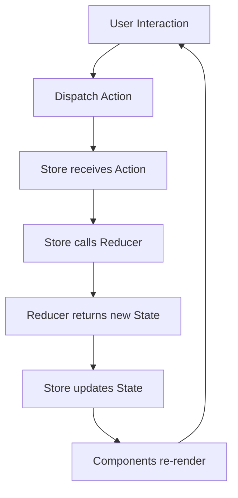

# Redux Complete Guide 📚

A comprehensive guide to understanding **Redux** - the flexible state container for JavaScript applications that manages application state in a single immutable state tree, separately from components.


## 📋 Table of Contents

- [What is Redux?](#what-is-redux)
- [Core Concepts](#core-concepts)
- [Redux Store Workflow](#redux-store-workflow)
- [React Integration](#react-integration)
- [Redux Toolkit](#redux-toolkit)
- [Development Tools](#development-tools)
- [Middleware](#middleware)
- [Advanced Patterns](#advanced-patterns)
- [Installation Guide](#installation-guide)
- [Code Examples](#code-examples)
- [Best Practices](#best-practices)

## 🎯 What is Redux?

Redux is a **flexible "State Container"** for JavaScript applications that manages your application state in a single immutable state tree **separately** from components.

### 🌍 Universal Compatibility
Redux is **not tied to React**! As long as it's JavaScript, you can use Redux with:

- ⚛️ **React** - Most common usage
- 🅰️ **Angular** - Enterprise applications
- 🟢 **Vue.js** - Progressive framework integration
- 🚀 **Node.js** - Backend state management
- 📱 **React Native** - Mobile applications
- 🌐 **Vanilla JS** - Pure JavaScript projects

```javascript
// Redux works everywhere JavaScript runs!
const frameworks = ['React', 'Angular', 'Vue', 'Node.js', 'React Native'];
frameworks.forEach(framework => console.log(`Redux + ${framework} = ❤️`));
```

## 🔄 Core Concepts

Redux follows a unidirectional data flow pattern with four main concepts:

### 1. 📋 **Action**

An **Action** is a plain JavaScript object that describes **what happened** in your application.

```javascript
// Action Structure
{
  type: 'ACTION_TYPE',      // Required: describes the action
  payload: 'data'           // Optional: additional data
}

// Real Examples
const addTodoAction = {
  type: 'ADD_TODO',
  text: 'Build my first Redux app'
};

const userLoginAction = {
  type: 'USER_LOGIN',
  payload: {
    username: 'john_doe',
    email: 'john@example.com'
  }
};

const incrementCounterAction = {
  type: 'INCREMENT',
  payload: 1
};
```

**Action Requirements:**
- ✅ Must have a `type` property
- ✅ Should be plain JavaScript objects
- ✅ Should be serializable
- ❌ Should not contain functions or non-serializable data

### 2. 🚀 **Dispatch**

**Dispatching** is the process of sending an action to the Redux store.

```javascript
// Basic Dispatch
store.dispatch({
  type: 'ADD_TODO',
  text: 'Build my first Redux app'
});

// Dispatch with Payload
store.dispatch({
  type: 'UPDATE_USER',
  payload: { id: 1, name: 'John Doe' }
});

// Action Creator Pattern
const addTodo = (text) => ({
  type: 'ADD_TODO',
  text
});

store.dispatch(addTodo('Learn Redux'));
```

**Dispatch Flow:**
1. 📤 Action is dispatched to store
2. 🔄 Store calls reducer with current state + action
3. 🆕 Reducer returns new state
4. 🔔 Subscribers are notified of state change

### 3. ⚙️ **Reducer**

A **Reducer** is a pure function that takes the current state and an action, then returns a new state.

```javascript
// Basic Reducer Structure
function todoReducer(state = initialState, action) {
  switch (action.type) {
    case 'ADD_TODO':
      return {
        ...state,
        todos: [...state.todos, {
          id: Date.now(),
          text: action.text,
          completed: false
        }]
      };
    
    case 'TOGGLE_TODO':
      return {
        ...state,
        todos: state.todos.map(todo =>
          todo.id === action.id
            ? { ...todo, completed: !todo.completed }
            : todo
        )
      };
    
    case 'DELETE_TODO':
      return {
        ...state,
        todos: state.todos.filter(todo => todo.id !== action.id)
      };
    
    default:
      return state;
  }
}

// Initial State
const initialState = {
  todos: [],
  filter: 'ALL',
  loading: false
};
```

**Reducer Formula:**
```javascript
reducer(currentState, action) => newState
```

**Reducer Rules:**
- ✅ **Pure Function** - Same input always produces same output
- ✅ **Immutable** - Never modify existing state directly
- ✅ **No Side Effects** - No API calls, routing, or async operations
- ✅ **Default Case** - Always return current state for unknown actions

### 4. 🏪 **Store**

The **Store** is the central hub that holds the application state and orchestrates the Redux flow.

```javascript
import { createStore } from 'redux';

// Create Store
const store = createStore(todoReducer);

// Store Methods
store.getState();                    // Get current state
store.dispatch(action);              // Dispatch an action
store.subscribe(listener);           // Listen to state changes

// Example Usage
const store = createStore(todoReducer);

// Subscribe to changes
const unsubscribe = store.subscribe(() => {
  console.log('State updated:', store.getState());
});

// Dispatch actions
store.dispatch({ type: 'ADD_TODO', text: 'Learn Redux' });
store.dispatch({ type: 'ADD_TODO', text: 'Build an app' });

// Unsubscribe when done
unsubscribe();
```

## 📊 Redux Store Workflow



### Step-by-Step Flow:

1. **🖱️ User Interaction**: User clicks button, submits form, etc.
2. **📤 Action Dispatch**: Component dispatches an action
3. **📨 Store Receives**: Store receives the action
4. **⚙️ Reducer Called**: Store calls reducer with current state + action
5. **🆕 New State**: Reducer returns new immutable state
6. **🔄 State Update**: Store updates its state
7. **🎨 UI Update**: Connected components re-render

## ⚛️ React Integration

React-Redux provides hooks to connect React components with Redux store:

### 🎣 **useSelector Hook**

Access Redux store state in React components:

```javascript
import { useSelector } from 'react-redux';

function TodoList() {
  // Select specific data from state
  const todos = useSelector(state => state.todos);
  const filter = useSelector(state => state.filter);
  
  // Select with transformation
  const completedCount = useSelector(state =>
    state.todos.filter(todo => todo.completed).length
  );
  
  // Memoized selector for performance
  const visibleTodos = useSelector(state => {
    const { todos, filter } = state;
    switch (filter) {
      case 'COMPLETED':
        return todos.filter(todo => todo.completed);
      case 'ACTIVE':
        return todos.filter(todo => !todo.completed);
      default:
        return todos;
    }
  });

  return (
    <ul>
      {visibleTodos.map(todo => (
        <li key={todo.id}>{todo.text}</li>
      ))}
    </ul>
  );
}
```

**useSelector Best Practices:**
- ✅ Select only the data you need
- ✅ Use multiple selectors for different data pieces
- ✅ Consider memoization for expensive computations
- ❌ Don't select the entire state unless necessary

### 📤 **useDispatch Hook**

Get the dispatch function to send actions:

```javascript
import { useDispatch } from 'react-redux';

function AddTodo() {
  const dispatch = useDispatch();
  const [text, setText] = useState('');

  const handleSubmit = (e) => {
    e.preventDefault();
    
    // Dispatch action directly
    dispatch({
      type: 'ADD_TODO',
      text: text
    });
    
    setText('');
  };

  // With action creators
  const addTodo = (text) => ({
    type: 'ADD_TODO',
    text
  });

  const handleSubmitWithCreator = (e) => {
    e.preventDefault();
    dispatch(addTodo(text));
    setText('');
  };

  return (
    <form onSubmit={handleSubmit}>
      <input
        value={text}
        onChange={(e) => setText(e.target.value)}
        placeholder="Add a todo..."
      />
      <button type="submit">Add Todo</button>
    </form>
  );
}
```

### 🔌 **Provider Setup**

Wrap your app with Provider to make store available:

```javascript
import React from 'react';
import ReactDOM from 'react-dom';
import { Provider } from 'react-redux';
import { createStore } from 'redux';
import App from './App';
import rootReducer from './reducers';

const store = createStore(rootReducer);

ReactDOM.render(
  <Provider store={store}>
    <App />
  </Provider>,
  document.getElementById('root')
);
```

## 🛠️ Redux Toolkit

Redux Toolkit (RTK) is the **official, opinionated, batteries-included toolset** for efficient Redux development.

### 📦 Installation

```bash
npm install @reduxjs/toolkit react-redux
```

### 🎯 **Key Benefits**

- ✅ **Less Boilerplate** - Reduces code by up to 75%
- ✅ **Built-in Best Practices** - Includes Immer, DevTools, Thunk
- ✅ **TypeScript First** - Excellent TypeScript support
- ✅ **Modern Patterns** - Uses latest Redux patterns

### 🔧 **createSlice**

Simplifies reducer and action creation:

```javascript
import { createSlice } from '@reduxjs/toolkit';

const initialState = {
  todos: [],
  filter: 'ALL'
};

const todoSlice = createSlice({
  name: 'todos',
  initialState,
  reducers: {
    addTodo: (state, action) => {
      // Direct mutation with Immer under the hood
      state.todos.push({
        id: Date.now(),
        text: action.payload.text,
        completed: false
      });
    },
    
    toggleTodo: (state, action) => {
      const todo = state.todos.find(todo => todo.id === action.payload.id);
      if (todo) {
        todo.completed = !todo.completed;
      }
    },
    
    deleteTodo: (state, action) => {
      state.todos = state.todos.filter(todo => todo.id !== action.payload.id);
    },
    
    setFilter: (state, action) => {
      state.filter = action.payload;
    }
  }
});

// Auto-generated action creators
export const { addTodo, toggleTodo, deleteTodo, setFilter } = todoSlice.actions;

// Export reducer
export default todoSlice.reducer;
```

### 🏪 **configureStore**

Simplified store setup with good defaults:

```javascript
import { configureStore } from '@reduxjs/toolkit';
import todoReducer from './features/todos/todoSlice';
import userReducer from './features/user/userSlice';

export const store = configureStore({
  reducer: {
    todos: todoReducer,
    user: userReducer
  },
  // DevTools enabled by default in development
  // Thunk middleware included by default
  // Serializable check middleware included
});

export type RootState = ReturnType<typeof store.getState>;
export type AppDispatch = typeof store.dispatch;
```

### ⏰ **createAsyncThunk**

Handle async operations with automatic action generation:

```javascript
import { createAsyncThunk, createSlice } from '@reduxjs/toolkit';

// Async thunk
export const fetchTodos = createAsyncThunk(
  'todos/fetchTodos',
  async (userId, { rejectWithValue }) => {
    try {
      const response = await fetch(`/api/todos?userId=${userId}`);
      if (!response.ok) {
        throw new Error('Failed to fetch todos');
      }
      return await response.json();
    } catch (error) {
      return rejectWithValue(error.message);
    }
  }
);

const todoSlice = createSlice({
  name: 'todos',
  initialState: {
    items: [],
    status: 'idle',
    error: null
  },
  reducers: {
    // Sync reducers
  },
  extraReducers: (builder) => {
    builder
      .addCase(fetchTodos.pending, (state) => {
        state.status = 'loading';
        state.error = null;
      })
      .addCase(fetchTodos.fulfilled, (state, action) => {
        state.status = 'succeeded';
        state.items = action.payload;
      })
      .addCase(fetchTodos.rejected, (state, action) => {
        state.status = 'failed';
        state.error = action.payload;
      });
  }
});
```

## 🛠️ Development Tools

### 🔍 **Redux DevTools Extension**

A powerful browser extension for debugging Redux applications:

**Features:**
- 🕐 **Time Travel Debugging** - Step through actions
- 📊 **State Inspection** - View current and previous states
- 🎬 **Action Replay** - Replay sequences of actions
- 📈 **Performance Monitoring** - Track action performance
- 💾 **State Export/Import** - Save and restore state

**Installation:**
```bash
# Browser Extensions
# Chrome: Redux DevTools
# Firefox: Redux DevTools
```

**Usage:**
```javascript
// Manual setup (not needed with Redux Toolkit)
const store = createStore(
  rootReducer,
  window.__REDUX_DEVTOOLS_EXTENSION__ && window.__REDUX_DEVTOOLS_EXTENSION__()
);

// With Redux Toolkit (automatic)
const store = configureStore({
  reducer: rootReducer
  // DevTools enabled automatically in development
});
```

## 🔄 Middleware

### 🎯 **Redux Thunk**

Middleware for handling asynchronous actions:

```bash
npm install redux-thunk
```

```javascript
// Action creator that returns a function
const fetchUser = (userId) => {
  return async (dispatch, getState) => {
    dispatch({ type: 'FETCH_USER_START' });
    
    try {
      const response = await fetch(`/api/users/${userId}`);
      const user = await response.json();
      
      dispatch({
        type: 'FETCH_USER_SUCCESS',
        payload: user
      });
    } catch (error) {
      dispatch({
        type: 'FETCH_USER_ERROR',
        payload: error.message
      });
    }
  };
};

// Usage in component
const handleFetchUser = () => {
  dispatch(fetchUser(123));
};
```

**Thunk Benefits:**
- ✅ Handle async operations
- ✅ Access to dispatch and getState
- ✅ Conditional dispatching
- ✅ Side effect management

## 🎨 Advanced Patterns

### 🔧 **extraReducers**

Handle actions from other slices or external libraries:

```javascript
const postSlice = createSlice({
  name: 'posts',
  initialState: {
    items: [],
    loading: false,
    error: null
  },
  reducers: {
    // Regular reducers
    addPost: (state, action) => {
      state.items.push(action.payload);
    }
  },
  extraReducers: (builder) => {
    // Handle actions from createAsyncThunk
    builder
      .addCase(fetchPosts.pending, (state) => {
        state.loading = true;
        state.error = null;
      })
      .addCase(fetchPosts.fulfilled, (state, action) => {
        state.loading = false;
        state.items = action.payload;
      })
      .addCase(fetchPosts.rejected, (state, action) => {
        state.loading = false;
        state.error = action.error.message;
      })
      // Handle actions from other slices
      .addCase(userLoggedOut, (state) => {
        state.items = []; // Clear posts when user logs out
      });
  }
});
```

### 📁 **Feature-Based Architecture**

Organize code by features rather than file types:

```
src/
├── app/
│   └── store.js
├── features/
│   ├── todos/
│   │   ├── todoSlice.js
│   │   ├── TodoList.jsx
│   │   └── AddTodo.jsx
│   ├── user/
│   │   ├── userSlice.js
│   │   ├── UserProfile.jsx
│   │   └── userAPI.js
│   └── posts/
│       ├── postSlice.js
│       ├── PostList.jsx
│       └── postAPI.js
└── shared/
    ├── components/
    └── utils/
```

## 💻 Complete Code Example

Here's a full working example combining all concepts:

### 📂 Store Setup

```javascript
// app/store.js
import { configureStore } from '@reduxjs/toolkit';
import todoReducer from '../features/todos/todoSlice';
import userReducer from '../features/user/userSlice';

export const store = configureStore({
  reducer: {
    todos: todoReducer,
    user: userReducer
  }
});
```

### 🍰 Todo Slice

```javascript
// features/todos/todoSlice.js
import { createSlice, createAsyncThunk } from '@reduxjs/toolkit';

export const fetchTodos = createAsyncThunk(
  'todos/fetchTodos',
  async () => {
    const response = await fetch('/api/todos');
    return response.json();
  }
);

const todoSlice = createSlice({
  name: 'todos',
  initialState: {
    items: [],
    status: 'idle',
    filter: 'all'
  },
  reducers: {
    addTodo: (state, action) => {
      state.items.push({
        id: Date.now(),
        text: action.payload,
        completed: false
      });
    },
    toggleTodo: (state, action) => {
      const todo = state.items.find(todo => todo.id === action.payload);
      if (todo) {
        todo.completed = !todo.completed;
      }
    },
    setFilter: (state, action) => {
      state.filter = action.payload;
    }
  },
  extraReducers: (builder) => {
    builder
      .addCase(fetchTodos.pending, (state) => {
        state.status = 'loading';
      })
      .addCase(fetchTodos.fulfilled, (state, action) => {
        state.status = 'idle';
        state.items = action.payload;
      });
  }
});

export const { addTodo, toggleTodo, setFilter } = todoSlice.actions;
export default todoSlice.reducer;
```

### ⚛️ React Component

```javascript
// features/todos/TodoApp.jsx
import React, { useEffect, useState } from 'react';
import { useSelector, useDispatch } from 'react-redux';
import { addTodo, toggleTodo, setFilter, fetchTodos } from './todoSlice';

function TodoApp() {
  const [inputText, setInputText] = useState('');
  const dispatch = useDispatch();
  
  const { items: todos, status, filter } = useSelector(state => state.todos);
  
  const visibleTodos = todos.filter(todo => {
    if (filter === 'completed') return todo.completed;
    if (filter === 'active') return !todo.completed;
    return true;
  });

  useEffect(() => {
    dispatch(fetchTodos());
  }, [dispatch]);

  const handleSubmit = (e) => {
    e.preventDefault();
    if (inputText.trim()) {
      dispatch(addTodo(inputText));
      setInputText('');
    }
  };

  if (status === 'loading') {
    return <div>Loading todos...</div>;
  }

  return (
    <div>
      <h1>Todo App with Redux Toolkit</h1>
      
      <form onSubmit={handleSubmit}>
        <input
          value={inputText}
          onChange={(e) => setInputText(e.target.value)}
          placeholder="Add a todo..."
        />
        <button type="submit">Add Todo</button>
      </form>

      <div>
        <button onClick={() => dispatch(setFilter('all'))}>All</button>
        <button onClick={() => dispatch(setFilter('active'))}>Active</button>
        <button onClick={() => dispatch(setFilter('completed'))}>Completed</button>
      </div>

      <ul>
        {visibleTodos.map(todo => (
          <li key={todo.id}>
            <input
              type="checkbox"
              checked={todo.completed}
              onChange={() => dispatch(toggleTodo(todo.id))}
            />
            <span style={{
              textDecoration: todo.completed ? 'line-through' : 'none'
            }}>
              {todo.text}
            </span>
          </li>
        ))}
      </ul>
    </div>
  );
}

export default TodoApp;
```

## 🎯 Best Practices

### ✅ **Do's**

1. **Keep State Minimal and Flat**
   ```javascript
   // ✅ Good
   {
     todos: [{ id: 1, text: 'Learn Redux', completed: false }],
     filter: 'all'
   }
   
   // ❌ Avoid deep nesting
   {
     app: {
       ui: {
         todos: {
           list: [...]
         }
       }
     }
   }
   ```

2. **Use Action Creators**
   ```javascript
   // ✅ Good
   const addTodo = (text) => ({ type: 'ADD_TODO', payload: { text } });
   dispatch(addTodo('Learn Redux'));
   
   // ❌ Avoid inline actions
   dispatch({ type: 'ADD_TODO', payload: { text: 'Learn Redux' } });
   ```

3. **Normalize State Shape**
   ```javascript
   // ✅ Good - Normalized
   {
     posts: {
       byId: { 1: { id: 1, title: 'Post 1' } },
       allIds: [1]
     }
   }
   
   // ❌ Avoid arrays for large datasets
   {
     posts: [{ id: 1, title: 'Post 1' }]
   }
   ```

4. **Use Selectors for Derived Data**
   ```javascript
   // ✅ Good - Memoized selector
   const selectCompletedTodos = createSelector(
     [state => state.todos],
     todos => todos.filter(todo => todo.completed)
   );
   ```

### ❌ **Don'ts**

1. **Don't Mutate State Directly**
   ```javascript
   // ❌ Wrong
   state.todos.push(newTodo);
   
   // ✅ Correct (with Redux Toolkit)
   state.todos.push(newTodo); // Immer handles immutability
   
   // ✅ Correct (vanilla Redux)
   return { ...state, todos: [...state.todos, newTodo] };
   ```

2. **Don't Put Non-Serializable Data in State**
   ```javascript
   // ❌ Avoid
   {
     user: {
       profile: userInstance, // Class instance
       loginTime: new Date(), // Date object
       callback: () => {}     // Function
     }
   }
   
   // ✅ Use serializable data
   {
     user: {
       profile: { name: 'John', email: 'john@example.com' },
       loginTime: '2023-01-01T00:00:00Z',
       isLoggedIn: true
     }
   }
   ```

3. **Don't Connect Every Component**
   ```javascript
   // ❌ Avoid connecting leaf components unnecessarily
   function TodoItem({ todo }) {
     const dispatch = useDispatch(); // Not always needed
     // ...
   }
   
   // ✅ Pass props from connected parent
   function TodoList() {
     const todos = useSelector(state => state.todos);
     const dispatch = useDispatch();
     
     return (
       <div>
         {todos.map(todo => (
           <TodoItem 
             key={todo.id} 
             todo={todo}
             onToggle={() => dispatch(toggleTodo(todo.id))}
           />
         ))}
       </div>
     );
   }
   ```

## 🚀 Getting Started

### Quick Setup Checklist

1. **Install Dependencies**
   ```bash
   npm install @reduxjs/toolkit react-redux
   ```

2. **Create Store**
   ```javascript
   // app/store.js
   import { configureStore } from '@reduxjs/toolkit';
   
   export const store = configureStore({
     reducer: {
       // Add your slices here
     }
   });
   ```

3. **Provide Store to App**
   ```javascript
   // index.js
   import { Provider } from 'react-redux';
   import { store } from './app/store';
   
   root.render(
     <Provider store={store}>
       <App />
     </Provider>
   );
   ```

4. **Create Your First Slice**
   ```javascript
   // features/counter/counterSlice.js
   import { createSlice } from '@reduxjs/toolkit';
   
   export const counterSlice = createSlice({
     name: 'counter',
     initialState: { value: 0 },
     reducers: {
       increment: (state) => { state.value += 1; },
       decrement: (state) => { state.value -= 1; }
     }
   });
   
   export const { increment, decrement } = counterSlice.actions;
   export default counterSlice.reducer;
   ```

5. **Use in Components**
   ```javascript
   import { useSelector, useDispatch } from 'react-redux';
   import { increment, decrement } from './counterSlice';
   
   function Counter() {
     const count = useSelector(state => state.counter.value);
     const dispatch = useDispatch();
   
     return (
       <div>
         <button onClick={() => dispatch(increment())}>+</button>
         <span>{count}</span>
         <button onClick={() => dispatch(decrement())}>-</button>
       </div>
     );
   }
   ```

## 📚 Additional Resources

### Official Documentation
- [Redux Official Documentation](https://redux.js.org/)
- [Redux Toolkit Documentation](https://redux-toolkit.js.org/)
- [React-Redux Documentation](https://react-redux.js.org/)

### Learning Materials
- [Redux Essentials Tutorial](https://redux.js.org/tutorials/essentials/part-1-overview-concepts)
- [Redux Fundamentals Tutorial](https://redux.js.org/tutorials/fundamentals/part-1-overview)
- [Modern Redux with Redux Toolkit](https://redux.js.org/tutorials/quick-start)

### Advanced Topics
- [RTK Query for Data Fetching](https://redux-toolkit.js.org/rtk-query/overview)
- [Redux DevTools Guide](https://github.com/reduxjs/redux-devtools)
- [Performance Optimization](https://react-redux.js.org/api/hooks#performance)

---

**Happy coding with Redux! 🎉**

*This guide covers everything you need to know to get started with Redux and Redux Toolkit. Remember: Redux is all about predictable state management through unidirectional data flow.*
